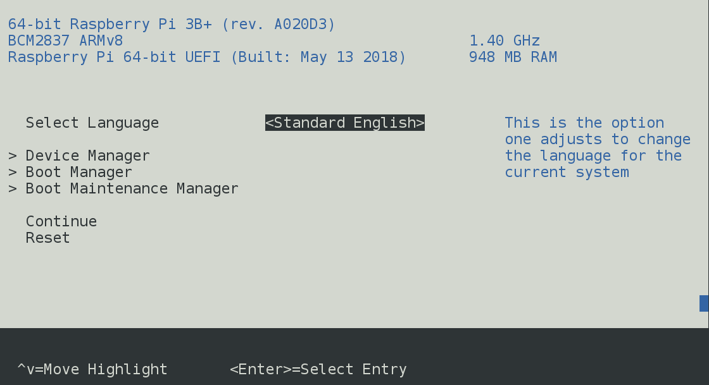

64-bit Tiano Core UEFI for the Raspberry Pi 3
=============================================

Last updated March 1st, 2018.

This is an implementation of a 64-bit UEFI firmware for the RPi3 platform,
based off Ard Bisheuvel's 64-bit `http://www.workofard.com/2017/02/uefi-on-the-pi/`
and Microsoft's 32-bit `https://github.com/ms-iot/RPi-UEFI/tree/ms-iot/Pi3BoardPkg`.

Initially, this was supposed to be an easy walk in the park, where
the Microsoft drivers just sorta slide into Ard's UEFI implementation,
and I call it a day. It turned out to be a bit more frustrating of an
experience than that :-).

# Purpose

This is meant as a generally useful 64-bit UEFI implementation for the Pi3, good
enough for most kinds of UEFI development and good enough for running real operating
systems. It has been validated to install and boot Linux (SUSE, Ubuntu) and FreeBSD.

# Latest Status

* 2018 Mar 1st: updated ATF to fix Ubuntu poweroff crash and add directions.
* 2018 Feb 27th: updated ATF to fix overheat on SYSTEM_OFF.
* 2018 Feb 26th: improved USB driver and HS support.
* 2018 Feb 22nd: improved USB support for keyboards.
* 2018 Jan 13th: updated build instructions, information on
  keyboards supported, added prebuilts.
* 2017 Dec 26th: USB hotplug and keyboard support.
* 2017 Dec 15th: Initial release.

# Features

Here is a comparison table between different available EFI firmware implementations
for the RPi3.

| Feature | This Implementation | Ard's  | Microsoft's | U-Boot |
| ------- | ------------------- | ------ | ----------- | ------ |
| **Bitness** | 64-bit | 64-bit | 32-bit | Either |
| **PSCI CPU_ON**  | Yes | No | No | No |
| **PSCI SYSTEM_RESET** | Yes | Yes | No | No |
| **DT** | Yes | Yes | No | Yes |
| **Pass-through DT** | Yes | No | N/A | Yes |
| **ACPI** | Limited | No | Yes | No |
| **Serial** | Yes | Yes | Yes | Yes |
| **HDMI GOP** | Yes | No | No | Yes |
| **SMBIOS** | Yes | No | Yes | No |
| **USB1** | Limited | No | No | Yes | 
| **USB2/3** | Yes | No | No | Yes |
| **USB Mass Storage** | Yes  | No | No | Yes |
| **USB Keyboard** | Yes | No | No | Yes |
| **Tiano** | Yes | Yes | Yes | No |
| **Windows IoT** | No | No | Yes | No |
| **AArch64 Linux** | Yes | Limited | No | Yes |
| **AArch32 Linux** | No | No | No | Yes |
| **AArch64 FreeBSD** | Yes | No | No | Yes |

# Building

**Note: If you want to use the [pre-built UEFI images](Binary/prebuilt), you can skip this section.**

1. Clone `https://github.com/tianocore/edk2.git` (last validated known-good SHA is `c3cb333e097036764afe240b179056ab8e320071` (Mon Nov 20 15:34:17 2017 +0800)).

2. Clone this repo.

3. Apply the [various patches against the edk2 tree](edk2Patches). Yes, it sucks to have to do this, but this is a clearer way forward than forking every single Tiano driver that has a bug in it, or worse - carrying around an entire private fork of edk2. You're welcome to upstream these patches!

To avoid issues, apply using `--ignore-whitespace`. E.g.:
```
$ git am --ignore-whitespace ../RaspberryPiPkg/edk2Patches/0001-MmcDxe-fix-invalid-HC_MMC_CSD_GET_DEVICESIZE-computa.patch
```

4. Run the following script to build. If you use a different GCC version, change accordingly,
and adjust the compiler prefix to match your system - i.e. set `GCC49_AARCH64_PREFIX` if you're
passing `-t GCC49` to `build`.

```
export WORKSPACE=$PWD
export PACKAGES_PATH=$WORKSPACE/edk2:$WORKSPACE/RaspberryPiPkg
export EDK_TOOLS_PATH=$WORKSPACE/edk2/BaseTools
export GCC5_AARCH64_PREFIX=aarch64-linux-gnu-

make -C $EDK_TOOLS_PATH
echo $EDK_TOOLS_PATH
. $WORKSPACE/edk2/edksetup.sh BaseTools

build -b DEBUG -a AARCH64 -t GCC5 -p RaspberryPiPkg/RaspberryPiPkg.dsc
build -b RELEASE -a AARCH64 -t GCC5 -p RaspberryPiPkg/RaspberryPiPkg.dsc
```

If you want to build your own ATF, instead of using the checked-in binaries, follow
the additional directions under [`Binary/atf/readme.md`](Binary/atf/readme.md).

# Using

## Basic

UEFI boot media can be an SD card or USB mass storage, if you've enabled USB booting previously in the OTP (i.e. via `program_usb_boot_mode=1`).

UEFI boot media must be MBR partitioned and FAT32 formatted.

As a starting point, take [the latest prebuilt image directories](RaspberryPiPkg/Binary/prebuilt/2018Feb22-GCC49/RELEASE/) and copy to empty boot media. If you've built your own UEFI from source
(e.g. `$WORKSPACE/Build/RaspberryPiPkg-AARCH64/RELEASE_GCC5/FV/RPI_EFI.fd`) you can simply now copy over and overwrite `RPI_EFI.fd`.

**Note: You *may not* have a kernel.img (or kernelX.img, where X is a digit) in the root
catalogue of the boot media. It will *not* boot.**

The most basic `config.txt` contents are:
```
arm_control=0x200
enable_uart=1
armstub=RPI_EFI.fd
disable_commandline_tags=1
```

This will boot UEFI and expose a device tree that is compatible with openSUSE Leap 42.2/42.3,
although it was found to work with Ubuntu 18.04 (Bionic Beaver) as well.

Of course use the debug variant (e.g. `$WORKSPACE/Build/RaspberryPiPkg-AARCH64/DEBUG_GCC5/FV/RPI_EFI.fd`) if necessary, but it will boot a lot slower due to the verbose spew.

HDMI and the mini-UART serial port can be used for output devices. Output is mirrored.
USB keyboards and the mini-UART serial port can be used as input.

USB keyboard support has been validated with a few keyboards:
- Logitech K750 (wireless)
- Dell SK-8125 keyboard (with built-in hub)
- Microsoft Natural Ergonomic Keyboard 4000

It has not been tested with Apple keyboards yet.

The boot order is hardcoded to first be the USB ports and then the SD card.
If there are no bootable media, you should be looking at the UEFI Shell.
ESC enters setup. F1 always boots the UEFI Shell.



Note: you cannot boot 32-bit OSes like Raspbian with this firmware. Aw, shucks, right?

## Custom Device Tree

Most likely, if you boot an OS other than openSUSE Leap 42.3, you will need to pass your own
distro- and kernel- specific device tree. This will need to be extracted from the
distributed media or from a running system (e.g that was booted via U-Boot).

This involves a few changes to the above `config.txt`:
```
...
disable_commandline_tags=2
device_tree_address=0x8000
device_tree_end=0x10000
device_tree=my_fdt.dtb
```

Note: the address range **must** be [0x8000:0x10000). `dtoverlay` and `dtparam` parameters are also supported.

## Custom `bootargs`

This firmware will honor the command line passed by the GPU via `cmdline.txt`.

Note, that the ultimate contents of `/chosen/bootargs` are a combination of several pieces:
- Original `/chosen/bootargs` if using the internal DTB. Seems to be completely discarded by GPU when booting with a custom device tree.
- GPU-passed hardware configuration. This one is always present.
- Additional boot options passed via `cmdline.txt`.

## openSUSE Leap 42.3

Download the Leap 42.3 RPi image first, from `http://download.opensuse.org/ports/aarch64/distribution/leap/42.3/appliances/` (e.g. `openSUSE-Leap42.3-ARM-XFCE-raspberrypi3.aarch64-2017.07.26-Build1.1` was good).

- `dd` image to media.
- If booting UEFI from same media:
  - In the `EFI` partition, delete everything but the `EFI` folder.
  - Follow the [basic steps for booting UEFI](#basic).

Login is `root`/`linux`. There is also a login available on the serial port.

**Note: if your media is USB, after first boot you must follow these steps, or you will have an unbootable system after first reboot:**
- Edit the file `/etc/dracut.conf.d/raspberrypi_modules.conf` to include as its first line:
```add_drivers+=" bcm2835-sdhost bcm2835_dma sdhci_bcm2835 dwc2 usbnet uas usb_storage usbcore usb_common "```
- mkinitrd

You may choose to remove `enable_uart=1` from `config.txt` to get your RPi3 to run
at full speed.

## Ubuntu (18.04 Bionic Beaver)

- Download `http://ports.ubuntu.com/ubuntu-ports/dists/bionic/main/installer-arm64/current/images/netboot/mini.iso` and write out to a USB stick.
- Boot installer.
- Install to another USB stick (SD slot is not available).
- Enjoy. SD slot will be available as mmcblk0.

There is a device tree blob under `http://ports.ubuntu.com/ubuntu-ports/dists/bionic/main/installer-arm64/current/images/device-tree/bcm2837-rpi-3-b.dtb`, which you will [need to use](#custom-device-tree) to if you want Wi-Fi and Bluetooth, but otherwise things seem to work just fine with
the bundled openSUSE Leap 42.2 device tree.

Note: don't use DEBUG builds of ATF (e.g. DEBUG builds of UEFI) with Ubuntu, as the latter
disables the mini-UART port, which the ATF relies on for logging. If you want to use a DEBUG
build of UEFI, you must use a release version of ATF. Follow the directions under [`Binary/atf/readme.md`](Binary/atf/readme.md).

For Wi-Fi and BT there are a few more steps, as certain firmware files appear to be missing from the installation:
- `cd /lib/firmware/brcm/`
- `wget https://raw.githubusercontent.com/RPi-Distro/firmware-nonfree/master/brcm/brcmfmac43430-sdio.txt`
- `wget https://github.com/OpenELEC/misc-firmware/raw/master/firmware/brcm/BCM43430A1.hcd`
- `apt-get install wireless-regdb`

## FreeBSD (r326622)

- Download
`http://ftp.freebsd.org/pub/FreeBSD/snapshots/ISO-IMAGES/12.0/FreeBSD-12.0-CURRENT-arm64-aarch64-RPI3-20171206-r326622.img.xz`
- Uncompress and `dd` to media.
- If booting UEFI from same media:
  - Delete everything from the `MSDOSBOOT` partition, except:
    - `EFI`
    - `overlays`
    - `bcm2710-rpi-3-b.dtb`
  - Follow the [basic steps for booting UEFI to boot from media](#basic).
- If not booting UEFI from same media:
  - Follow the [basic steps for booting UEFI to boot from media](#basic).
  - Copy `bcm2710-rpi-3-b.dtb` and `overlays` to the UEFI boot media.

Now replace `config.txt` in the UEFI boot media with:
```
arm_control=0x200
armstub=RPI_EFI.fd
enable_uart=1
disable_commandline_tags=2
dtoverlay=mmc
dtparam=audio=on,i2c_arm=on,spi=on
device_tree_address=0x8000
device_tree_end=0x10000
device_tree=bcm2710-rpi-3-b.dtb
```

For a different (newer) release, you will need to look at the original `config.txt`.

This should boot to login prompt on HDMI with USB HID as the input. Login is `root`/`root`.

Note: you must remove `dtoverlay=pi3-disable-bt`, if present, from `config.txt`, as both ATF and UEFI rely on the mini-UART being initialized.

PL011 serial console in FreeBSD is not supported, yet.

## Other

If using additional MBR-partitioned devices aside from the UEFI boot media, mind the MBR disk identifier, if your system
software is picky about that sort of thing.

# Bugs in Implemented Functionality

## SD

- MMC cards are untested.
- Non-SDHC/SDXC are untested.
- SD is slow as high-speed is not implemented.
- No card removal/replacement detection, tons of timeouts and slow down during boot without an SD card present.

## USB

- USB1 BBB mass storage devices untested (USB2 and USB3 devices are fine).
- USB1 CBI mass storage devices don't work (e.g. HP FD-05PUB floppy).

## ACPI

- No tables beyond SPCR and BGRT.

# Missing Functionality

- Network booting.
- Ability to switch UART use to PL011.
- Ability to switch SD card to the `SdHostDxe` driver.
- Persisted EFI variables.

# Licensing

All of the code is BSD licensed, with the exception of:
1) `DwUsbHostDxe`, which I've documented as being GPL 2.0 licensed, since
   it appears to be directly related to the U-Boot driver.

# Contact

Andrey Warkentin <andrey.warkentin@gmail.com>

Btw, feel free to upstream, if so inclined.
